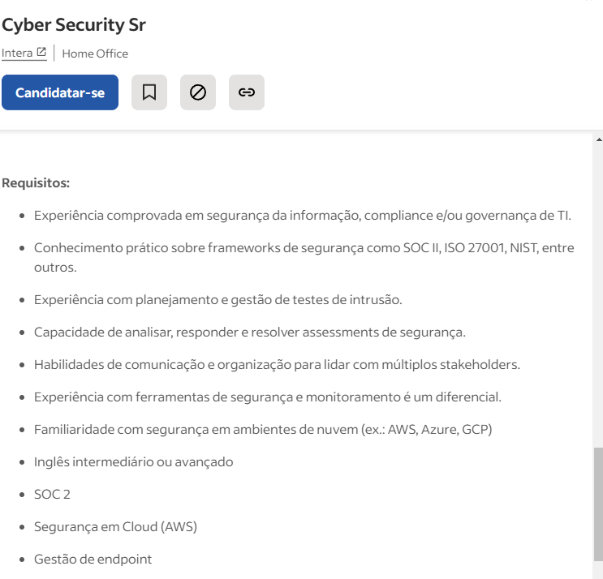

# LAB 1

[Carreiras](https://niccs.cisa.gov/workforce-development/cyber-career-pathways-tool)

| 1- Cargo                            | 2 - Nome da Empresa  | 3 - Nível (Iniciante, Médio, Sênior) | 4 - Localização   | 5 - Fonte de quadro de  empregos na Internet |
| ----------------------------------- | -------------------- | ------------------------------------ | ----------------- | -------------------------------------------- |
| Pentester Júnior                    | It4us Cyber Security | Iniciante                            | REMOTO            | LINKEDIN                                     |
| Pen Tester                          | Bosch Brasil         | Medio/Senior                         | REMOTO SP         | LINKEDIN                                     |
| Analista de Segurança               | Solo Network         | Iniciante                            | REMOTO Pinhais PR | LINKEDIN                                     |
| Analista de Segurança da Informação | Binario.net          | Iniciante                            | REMOTO            | LINKEDIN                                     |
| Cyber Security Sr                   | Intera               | Sênior                               | REMOTO            | INDEED                                       |
| Offensive Engineer                  | Unico                | Sênior                               | REMOTO            | INDEED                                       |
| Analista de Segurança (Red Team)    | LWSA                 | Médio                                | REMOTO            | GLASSDOOR                                    |

