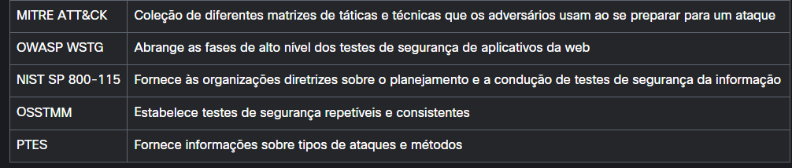

# Quiz

[P]Qual afirmação descreve melhor o termo hacker ético?
[R]uma pessoa que imita um invasor para avaliar a postura de segurança de uma rede

[P]Qual termo de agente de ameaça descreve um grupo bem financiado e motivado que usará as técnicas de ataque mais recentes para obter ganhos financeiros?
[R]crime organizado

[P]Que tipo de agente de ameaça usa o crime cibernético para roubar dados confidenciais e revelá-los publicamente para envergonhar o alvo?
[R]Que tipo de agente de ameaça usa o crime cibernético para roubar dados confidenciais e revelá-los publicamente para envergonhar o alvo?

[P]O que é um ataque patrocinado pelo Estado?
[R]Um ataque perpetrado por governos no mundo todo para interromper ou roubar informações de outras nações.

[P]O que é um ataque de ameaça interna?
[R]Um ataque perpetrado por funcionários descontentes dentro de uma organização.

[P]Que tipo de fraqueza de segurança é avaliada por testes de penetração baseados em aplicativos?
[R]falhas lógicas

[P]Quais são os dois recursos avaliados por um teste de penetração de infraestrutura de rede? (Escolha duas.)
[R]Servidores AAA / IPS

[P]Ao conduzir um teste de penetração baseado em aplicativo em um aplicativo web, a avaliação também deve incluir testes de acesso a quais recursos?
[R]O teste de penetração baseado em aplicativo foca em testar fraquezas de segurança em aplicativos corporativos. Essas fraquezas podem incluir, mas não estão limitadas a, configurações incorretas, problemas de validação de entrada, problemas de injeção e falhas lógicas. Como um aplicativo da web é normalmente construído em um servidor da web com um banco de dados back-end, o escopo do teste também normalmente inclui o banco de dados.

[P]Qual é o propósito dos programas de recompensa por bugs usados ​​pelas empresas?
[R]Empresas (por exemplo, Microsoft, Apple, Cisco) e instituições governamentais (por exemplo, o Departamento de Defesa dos EUA) usam programas de recompensa por bugs para recompensar profissionais de segurança quando encontram vulnerabilidades em sites, aplicativos ou qualquer sistema. Isso permite que a organização conserte essas vulnerabilidades antes que os agentes de ameaças as explorem.

[P]O que caracteriza um teste de penetração em ambiente parcialmente conhecido?
[R]O teste é uma abordagem híbrida entre testes de ambiente conhecido e desconhecido.

[P]O que caracteriza um teste de penetração em ambiente conhecido?
[R]O testador pode receber diagramas de rede, endereços IP, configurações e credenciais de usuário.

[P]Que tipo de teste de penetração forneceria ao testador apenas informações limitadas, como nomes de domínio e endereços IP no escopo?
[R]Em um teste de penetração em ambiente desconhecido (anteriormente conhecido como caixa-preta), o testador normalmente tem apenas uma quantidade muito limitada de informações. Por exemplo, o testador pode fornecer apenas os nomes de domínio e endereços IP no escopo para um alvo específico. O testador ainda teria que obter conhecimento prévio do alvo e da infraestrutura da organização.

[P]Associe a metodologia de teste de penetração à descrição.
[R]

[P]Quais três opções são fases no Padrão de Execução de Teste de Penetração (PTES)? (Escolha três.)
[R]O Penetration Testing Execution Standard (PTES) **fornece informações sobre tipos de ataques e métodos**, e **fornece informações sobre as últimas ferramentas disponíveis para realizar os métodos de teste descritos**. Ele envolve sete fases: **Interações de pré-engajamento**, **Coleta de inteligência**, **Modelagem de ameaças**, **Análise de vulnerabilidade**, **Exploração**, **Pós-exploração** e **Relatórios**.

[P]Quais duas opções são fases no Information Systems Security Assessment Framework (ISSAF)? (Escolha duas.)
[R]O Information Systems Security Assessment Framework (ISSAF) é uma metodologia de penetração com as seguintes fases: **coleta de informações**, **mapeamento de rede**, **identificação de vulnerabilidades**, **penetração**, **obtenção de acesso** e **escalonamento de privilégios**, **enumeração posterior**, **comprometimento de usuários/sites remotos**, **manutenção de acesso** e **cobertura de rastros**.

[P]Quais duas opções são fases no Manual de Metodologia de Teste de Segurança de Código Aberto (OSSTMM)? (Escolha duas.)
[R]O Open Source Security Testing Methodology Manual (OSSTMM) é um documento que apresenta testes de segurança repetíveis e consistentes. Ele tem as seguintes seções principais: **Métricas de Segurança Operacional**, **Análise de confiança**, **Fluxo de trabalho**, **Teste de segurança humana**, **Teste de segurança física**, **Teste de segurança sem fio**, **Teste de segurança de telecomunicações**, **Teste de segurança de redes de dados**, **Regulamentos de conformidade e Relatórios com o Security Test Audit Report (STAR)**.

[P]Qual metodologia de teste de penetração é um guia abrangente focado em testes de aplicativos web?
[R]OWASP Web Security Testing Guide (**WSTG**) **é um guia abrangente focado em testes de aplicativos web**. É uma compilação de muitos anos de trabalho de membros da OWASP. Ele abrange as fases de alto nível dos testes de segurança de aplicativos web e se aprofunda nos métodos de teste usados.

[P]Qual opção é uma distribuição Linux que inclui ferramentas e recursos de teste de penetração?
[R]Black-Arch (blackarch.org)

[P]Qual opção é uma URL de distribuição Linux que fornece um ambiente de aprendizado conveniente sobre ferramentas e metodologias de teste de penetração?
[R]Muitas distribuições Linux diferentes incluem ferramentas e recursos de teste de penetração, como Kali Linux (kali.org), Parrot OS (**parrotsec**.org) e Black-Arch (blackarch.org). Essas distribuições Linux fornecem um ambiente muito conveniente para aprender sobre as diferentes ferramentas e metodologias de segurança usadas em testes de penetração.

[P]O que significa o requisito de "Monitoramento de Saúde" ao configurar um ambiente de laboratório de teste de penetração?
[R]Alguns requisitos para um ambiente típico de teste de penetração são:
- Rede fechada: o testador precisa garantir acesso controlado de e para o ambiente de laboratório e acesso restrito à Internet
- Monitoramento de saúde: quando algo falha, o testador precisa ser capaz de determinar por que isso aconteceu
- Recursos de hardware suficientes: o testador precisa ter certeza de que a falta de recursos não é a causa de resultados falsos
- Ferramentas duplicadas: uma maneira de validar uma descoberta é executar o mesmo teste com uma ferramenta diferente para ver se os resultados são os mesmos

[P]Qual ferramenta seria útil ao realizar um teste de penetração de infraestrutura de rede?
[R]ferramenta de bypass de firewalls e IPSs

[P]Qual ferramenta deve ser usada para executar um teste de penetração baseado em aplicativo?
[R]As ferramentas usadas em testes de penetração dependem do tipo de teste a ser feito. Testes de penetração baseados em aplicativos **podem incluir ferramentas explicitamente criadas para escanear e detectar vulnerabilidades da web e ferramentas de teste manual, como proxies de interceptação**.

[P]Quais ferramentas devem ser usadas para realizar um teste de penetração de infraestrutura sem fio?
[R]As ferramentas usadas em testes de penetração dependem do tipo de teste a ser feito. Testes de penetração de infraestrutura sem fio **podem usar ferramentas para quebrar criptografia sem fio**, **desautorizar dispositivos de rede e executar ataques on-path** (também chamados de ataques man-in-the-middle).

[P]Quais ferramentas devem ser usadas para testar as plataformas de servidor e cliente em um ambiente?
[R]Para testar as plataformas de servidor e cliente em um ambiente, várias **ferramentas automatizadas de escaneamento de vulnerabilidade** podem ser usadas para identificar coisas como software desatualizado e configurações incorretas. **Para testar a robustez dos protocolos, ferramentas de fuzzing são normalmente usadas**.

[P]Às vezes, um testador não pode virtualizar um sistema para fazer o teste de penetração adequado. Que ação deve ser tomada se um sistema não puder ser testado em um ambiente virtualizado?
[R]Ser capaz de recuperar seu ambiente de produção é importante por muitas razões. Ao fazer testes de penetração, o testador quebrará coisas, não importa quais ferramentas sejam adotadas. Às vezes, quando as coisas quebram, elas não se recuperam sem suporte. Usar algum ambiente virtual é ideal, pois oferece instantâneos e recursos de restauração para o estado do sistema. Em tal caso em que o sistema não pode ser virtualizado, é necessário ter um backup completo do sistema ou ambiente.

[P]
[R]

[P]
[R]

[P]
[R]

[P]
[R]

[P]
[R]

[P]
[R]

[P]
[R]

[P]
[R]

[P]
[R]

[P]
[R]

[P]
[R]

[P]
[R]

[P]
[R]

[P]
[R]

[P]
[R]

[P]
[R]

[P]
[R]

[P]
[R]

[P]
[R]

[P]
[R]

[P]
[R]

[P]
[R]

[P]
[R]

[P]
[R]
